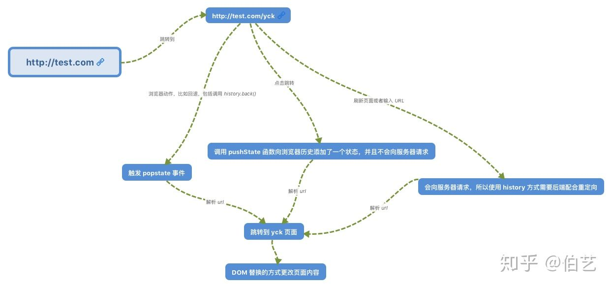

# 一 前端路由原理
前端路由有两种，`hash`和`history`。
现在世面上主要用`history`路由，相比`hash`方式，API更友好，切换路由时携带数据更方便

## 1.1 比较两种
1. 是否需要服务器支持？
    - hash不需要，因为`#hash`并没有改变url的地址，始终指向同一个地址，可以静态部署
    - history需要，url改变了，需要服务器把所有路由都重定向到根页面
2. 用户访问url或手动刷新时？
    - hash：始终返回同一个html，静态地址即可
    - history：访问非根目录的路由时，需要后端重定向到根页面，并返回根页面的html
3. 用户在页面内进行跳转时？
    - 都不会向服务器发起请求，执行内部的js代码
4. 跳转的参数
    - hash：hash值就是参数，参数携带在url中
    - history：参数携带在state中

## 1.2 三种行为对应的事件
1. 页面加载或刷新：触发onload事件
2. 相同url下改变hash：触发hashchange事件
3. history路由切换：无官方事件触发
4. 导航的前进后退：触发onpopstate事件

## 现象1：在https://lemonc747.github.io/react-playground/内路由跳转可以正常跳转，但刷新后就github-404页面了？
因为`github.io`上是静态的html，访问根页面时，url指向根页面的地址正确。
由`1.1 2&3`可知，之后路由的跳转都是页面内js执行，都没有向服务器重新请求页面。
但是实际上此时的路由并没有对应`index.html`，当用户刷新或重新访问该地址，请求到达`github`服务器上，
发现没有对应的文件，然后重定向到github自己的404页面了

# 二 hash路由
在url中添加`#[hash]`，即可改变url的hash值。

原理：通过监听全局的`hashChange`事件，当url的hash改变时进行判断和匹配


```ts
// 监听hash的改变
// option 1
window.addEventListener('hashchange', function() {
  if (location.hash === '#rightHash') {
    console.log("You're visiting a cool feature!");
  }
}, false);
// option 2
window.onhashchange = () => {
   if (location.hash === '#rightHash') {
    console.log("You're visiting a cool feature!");
  }
}
// 改变hash
location.hash = "#hash1";
```

# 三 history路由


## 3.1 history api
[reference:MDN-history](https://developer.mozilla.org/en-US/docs/Web/API/History)

- forward: 导航前进
- back: 导航后退
- go: 导航前进或后退几页
- pushState: 添加新的历史记录
- replaceState: 修改当前页的历史记录
- onpopstate: 导航前进或后退时触发，获取当前历史记录携带的state数据

### pushState
```ts
(method) History.pushState(data: any, unused: string, url?: string | URL | null | undefined): void
```


# 四 浏览器URL跳转原理

点击URL或前进后退，具体发生了什么
